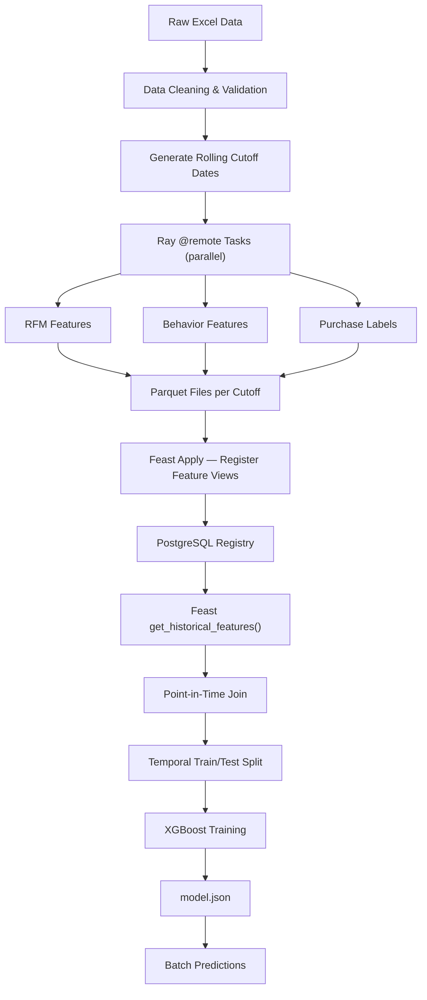
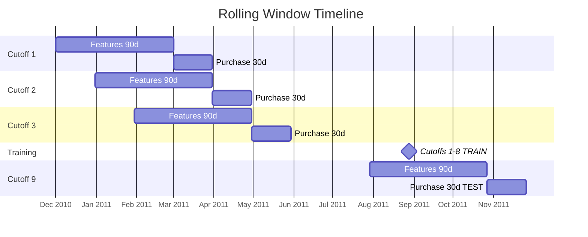

# FeatForge — Scalable Feature Engineering with Feast and Ray

<p align="center">
  <a href="https://www.python.org/downloads/"></a>
  
  
  
  
</p>

> **Build production-grade ML feature pipelines that scale.** FeatForge engineers RFM and behavioral customer features across rolling time windows using Ray for parallel computation and Feast for point-in-time-correct feature serving — predicting 30-day purchase propensity on the UCI Online Retail dataset.

---

## Table of Contents

- [The Problem](#the-problem)
- [The Solution](#the-solution)
- [Key Features](#key-features)
- [How It Works](#how-it-works)
- [Rolling Window Design](#rolling-window-design)
- [Architecture](#architecture)
- [Feature Store Design](#feature-store-design)
- [Quickstart](#quickstart)
- [Feature Reference](#feature-reference)
- [Makefile Commands](#makefile-commands)
- [Project Structure](#project-structure)
- [Production Path](#production-path)
- [License](#license)
- [Author & Contact](#-author--contact)

---

## The Problem

Most ML teams hit the same feature engineering wall as their models move toward production:

| Challenge | Consequence |
|---|---|
| **No feature versioning** | Can't reproduce model runs from last month |
| **Training-serving skew** | Features computed differently in training vs. inference |
| **Sequential computation** | Rolling window features over millions of rows take hours |
| **Flat file storage** | CSV/Parquet lacks schema enforcement and temporal joins |
| **Manual cutoff management** | Single train/test split wastes temporal data |

FeatForge addresses all five with a Feast feature store and Ray distributed compute.

---

## The Solution

FeatForge implements a complete **propensity modeling pipeline** — from raw transaction data to trained XGBoost model — with proper feature store management and parallel execution.



---

## Key Features

### Parallel Feature Engineering with Ray
- Each rolling cutoff date runs as an independent `@ray.remote` task
- All cutoffs execute **simultaneously** instead of sequentially
- Scales from laptop (4 cores) to cluster (100+ workers) with zero code changes

### Point-in-Time Correct Feature Serving
- Feast's `get_historical_features()` performs temporal joins automatically
- Entity key `(customer_id, event_timestamp)` ensures no data leakage
- Same feature definitions used in training and batch prediction — zero skew

### Rolling Window Snapshots
- **90-day feature window** before each cutoff date
- **30-day label window** after each cutoff
- Cutoffs spaced 30 days apart → ~9 snapshots → ~17,000 training rows (vs. ~3,700 single-cutoff)

### Production-Grade Feature Store
- **PostgreSQL registry** for multi-user feature metadata (vs. local SQLite)
- **Ray offline store** for distributed parquet reads at scale
- Feature views with schema enforcement and lineage tracking

### End-to-End Makefile Pipeline
- Single `make all` command runs the complete pipeline
- Individual steps available for debugging and incremental runs
- Docker Compose manages PostgreSQL lifecycle

---

## How It Works

### Phase 1 — Data Preparation

Raw UCI Online Retail transactions are cleaned (remove cancellations, nulls), customer IDs validated, and rolling cutoff dates generated every 30 days across the dataset span.

### Phase 2 — Parallel Feature Engineering

Ray dispatches one remote task per cutoff date. Each task computes RFM features (recency, frequency, monetary, tenure) and behavioral features (order value, basket size, product diversity, return rate, purchase cadence) from the 90-day window, plus a binary purchase label from the 30-day forward window.

### Phase 3 — Feature Registration

Parquet files are registered as Feast data sources. Two feature views (`customer_rfm_features`, `customer_behavior_features`) are defined with entity, schema, and TTL. `feast apply` writes definitions to PostgreSQL.

### Phase 4 — Training

Feast retrieves historically correct features for all training cutoff dates via point-in-time join. XGBoost trains on earlier cutoffs, tests on the latest cutoff (temporal split). Model saved as JSON (no pickle vulnerabilities).

### Phase 5 — Prediction

Batch inference retrieves features for the latest cutoff only and generates purchase propensity scores per customer.

---

## Rolling Window Design

```
Timeline:  ──────────────────────────────────────────────────────►

Cutoff C₁:  [── 90d features ──|C₁|── 30d label ──]
Cutoff C₂:       [── 90d features ──|C₂|── 30d label ──]
Cutoff C₃:            [── 90d features ──|C₃|── 30d label ──]
                              ...
Cutoff C₉:                              [── 90d features ──|C₉|── 30d label ──]
                                         ↑ TRAIN on C₁–C₈    ↑ TEST on C₉
```



Each customer appears at multiple cutoffs with different feature values and potentially different labels — yielding **~17,000 training rows** from ~3,700 unique customers.

---

## Architecture

```
Raw Data (Online Retail.xlsx)
    │
    ├─> Data Ingestion ──────────── load, clean, validate transactions
    │
    ├─> Cutoff Generator ────────── rolling 30-day spaced cutoff dates
    │
    ├─> Ray Feature Engine ──────── parallel @remote tasks per cutoff
    │       ├─> RFM Features ────── recency, frequency, monetary, tenure
    │       ├─> Behavior Features ─ order value, basket size, diversity
    │       └─> Label Generator ─── 30-day forward purchase binary
    │
    ├─> Feast Registry ──────────── PostgreSQL metadata store
    │       └─> Feature Views ───── schema, lineage, TTL definitions
    │
    ├─> Feast Offline Store ─────── Ray-backed parquet retrieval
    │       └─> Point-in-Time Join ─ temporal feature assembly
    │
    ├─> XGBoost Trainer ─────────── temporal split → train → model.json
    │
    └─> Batch Predictor ─────────── latest cutoff → predictions.parquet
```

---

## Feature Store Design

| Layer | Technology | Purpose |
|---|---|---|
| **Registry** | PostgreSQL (Docker) | Feature metadata, schemas, versioning |
| **Offline Store** | Ray + Parquet | Historical feature retrieval at scale |
| **Online Store** | Not configured | Add Redis/DynamoDB for real-time serving |
| **Data Sources** | FileSource (Parquet) | Swap for BigQuery/Snowflake in production |

**Why PostgreSQL over SQLite?** Simulates production multi-user registry access. Multiple data scientists can register and retrieve features concurrently without file-lock conflicts.

**Why Ray offline store?** Feast's `RayOfflineStore` distributes parquet reads and point-in-time joins across workers. On a 17K-row dataset this is fast locally; on millions of rows it scales to a Ray cluster with no code changes.

---

## Quickstart

### Prerequisites

- Python 3.10+
- Docker Desktop (running)
- 2 GB free disk space

### Setup

```bash
git clone <repository-url> featforge
cd featforge

# Download UCI Online Retail dataset
# Place at: data/input/Online Retail.xlsx

python -m venv venv
source venv/bin/activate          # Windows: venv\Scripts\activate
pip install -r requirements.txt
```

### Run Full Pipeline

```bash
make all    # db → prep → apply → train (one command)
```

Expected output:
1. PostgreSQL container starts (Feast registry)
2. Ray computes features across ~9 cutoffs in parallel
3. Feature views registered in Feast
4. XGBoost model trained and saved to `models/xgb_purchase_model.json`

---

## Feature Reference

### `customer_rfm_features` — Customer Value Signals (90-day window)

| Feature | Type | Description |
|---|---|---|
| `recency_days` | int | Days since last purchase in the window |
| `frequency` | int | Number of distinct orders in the window |
| `monetary` | float | Total spend in the window |
| `tenure_days` | int | Days since customer's first-ever purchase (all-time) |

### `customer_behavior_features` — Purchase Pattern Signals (90-day window)

| Feature | Type | Description |
|---|---|---|
| `avg_order_value` | float | Mean spend per order |
| `avg_basket_size` | float | Mean items per order |
| `n_unique_products` | int | Product diversity (unique SKUs purchased) |
| `return_rate` | float | Share of cancelled/returned orders |
| `avg_days_between_purchases` | float | Mean purchase cadence in days |

---

## Makefile Commands

| Command | Action | Duration |
|---|---|---|
| `make all` | Full pipeline: db → prep → apply → train | ~5 min |
| `make db` | Start PostgreSQL Docker container | ~10 sec |
| `make prep` | Ray parallel feature engineering → parquets | ~2 min |
| `make apply` | Register feature views in Feast registry | ~5 sec |
| `make train` | Feast retrieval → temporal split → XGBoost | ~1 min |
| `make predict` | Batch predictions on latest cutoff | ~30 sec |
| `make clean-db` | Stop PostgreSQL and remove data volume | ~5 sec |

---

## Project Structure

```
featforge/
├── data/
│   └── input/
│       └── Online Retail.xlsx       # Raw UCI dataset
├── feature_store/
│   ├── feature_store.yaml           # Feast configuration
│   ├── definitions.py               # Entity + FeatureView definitions
│   └── data/                        # Generated parquet files
├── src/
│   ├── config.py                    # Centralized configuration
│   ├── pipeline.py                  # Top-level Ray orchestrator
│   ├── data_prep/
│   │   ├── ingestion.py             # Raw data loading and cleaning
│   │   ├── cutoffs.py               # Rolling cutoff date generation
│   │   └── labels.py                # Purchase label computation
│   ├── feature_engineering/
│   │   ├── rfm_features.py          # RFM feature computation
│   │   └── behavior_features.py     # Behavioral feature computation
│   ├── train.py                     # Feast retrieval → XGBoost training
│   └── predict.py                   # Batch prediction
├── models/                          # Saved model + predictions
├── docker-compose.yml               # PostgreSQL for Feast registry
├── Makefile                         # Pipeline orchestration
└── requirements.txt
```

---

## Production Path

| Local (FeatForge) | Production Equivalent |
|---|---|
| PostgreSQL (Docker) | Cloud SQL / Amazon RDS |
| Local Ray session | Ray cluster via `ray_address` |
| FileSource (Parquet) | BigQuerySource / SnowflakeSource |
| `make apply` in terminal | CI/CD pipeline step |
| `model.json` on disk | Model registry (MLflow, Vertex AI) |

No application code changes required — only Feast config and infrastructure swap.

---

## License

MIT License

---

## 👤 Author & Contact

- **Author**: Nathaniel Gordon
- **Role**: Senior AI & Machine Learning Engineer
- **GitHub**: [github.com/nathaniel-gordon](https://github.com/nathaniel-gordon)
- **Portfolio / Upwork**: [upwork.com/freelancers/~015fe5a704f8943797](https://www.upwork.com/freelancers/~015fe5a704f8943797)
- **Email**: nathanielgordon346@gmail.com
- **Location**: Tallahassee, FL, USA
